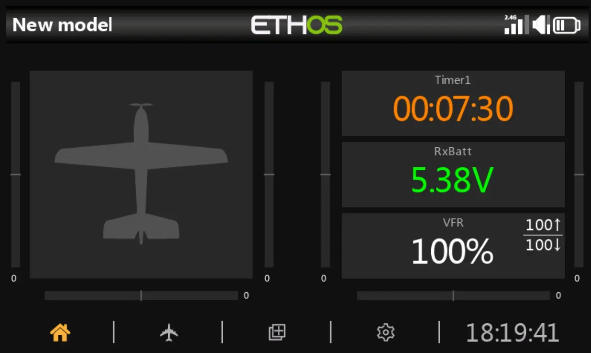
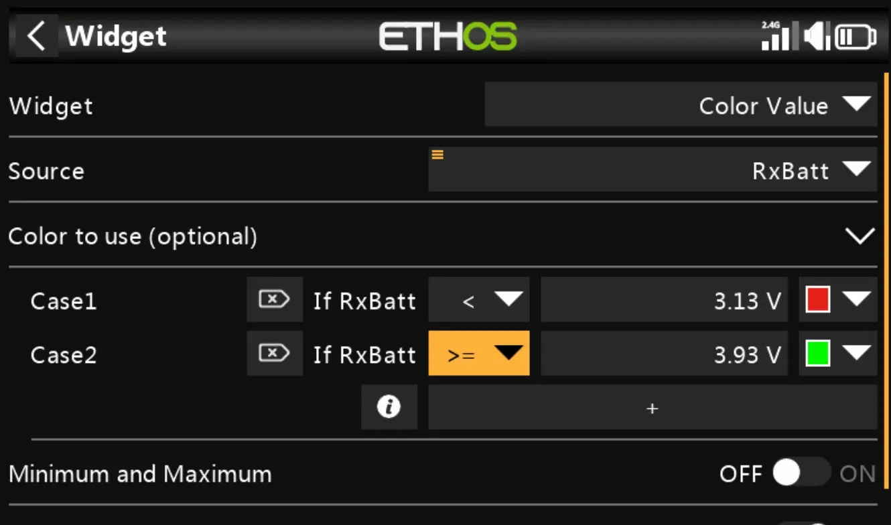
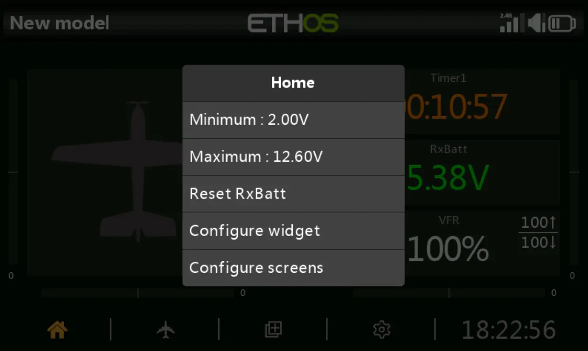
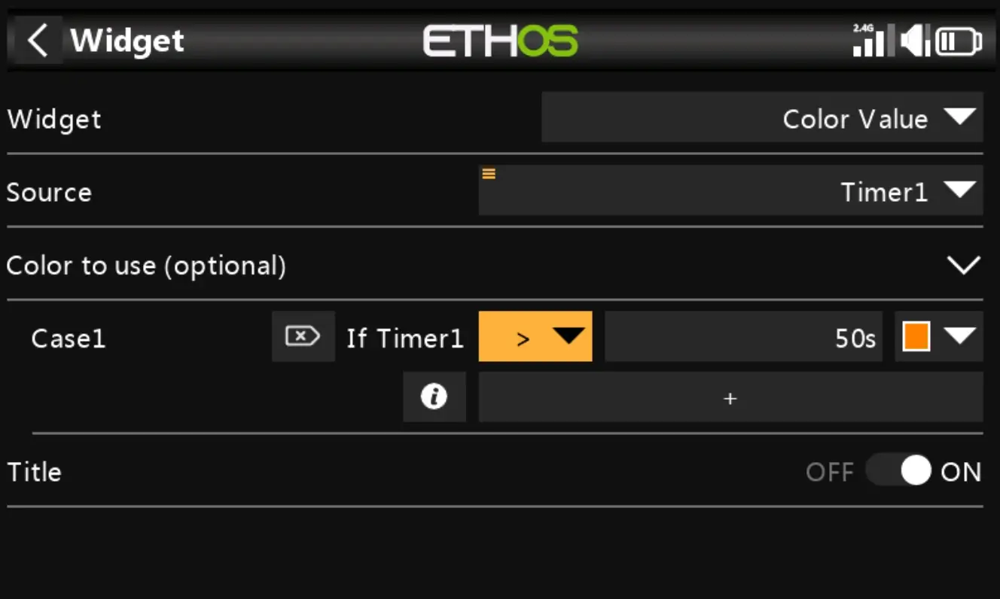
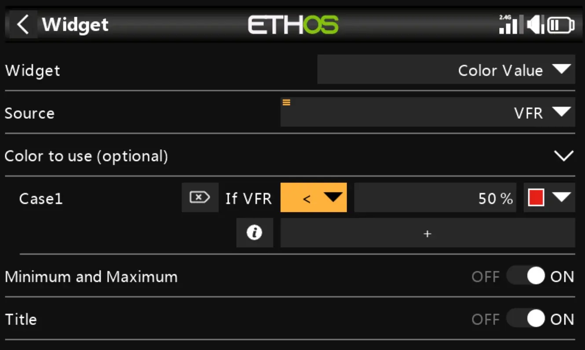

# Color Value : Lua Ethos Widget

## Features

- Mimics the Ethos's Value widget
- Adapts to many widget sizes
- Dark and Light themes supported
- Up to 5 configurable thresholds, each with his own color
- Telemetry values may display the minimum and the output inside the widget or using the contextual menu
- Works fine with timers too
- International language support (french/english)

## ScreenShots

A view of the home page

RxBatt configuration screen (Min/Max OFF)

RxBatt contextual menu

Timer colorization

VFR configuration screen (Min/Max ON)

## What's in the box ?

When you install this file, it will install two widgets: **Color Value** and **Color Telemetry**. Both share the same code, the difference is that the **Color Telemetry** limits the source to be a sensor value.
