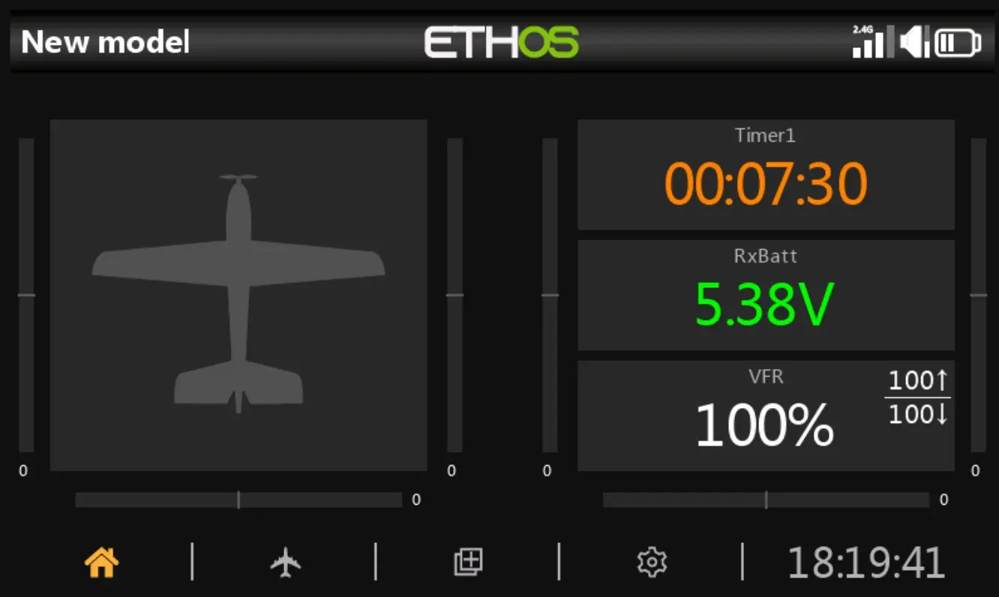
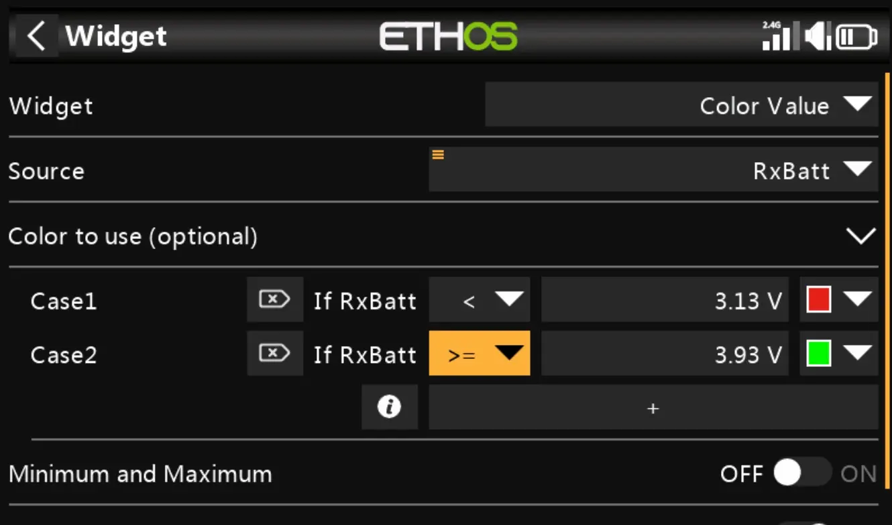
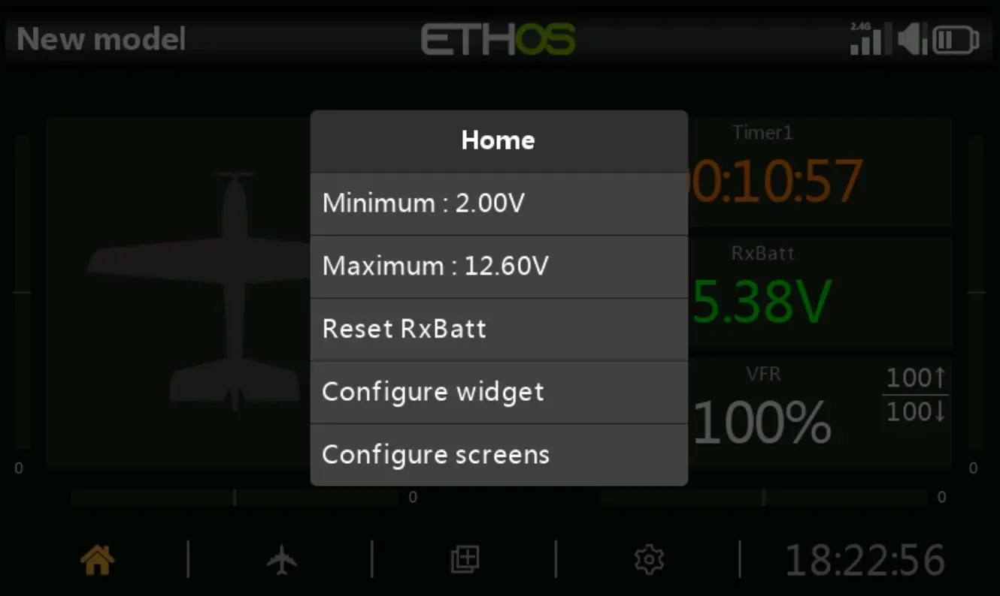
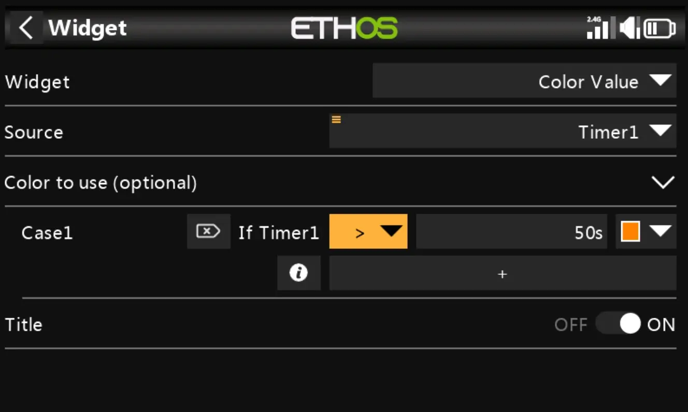
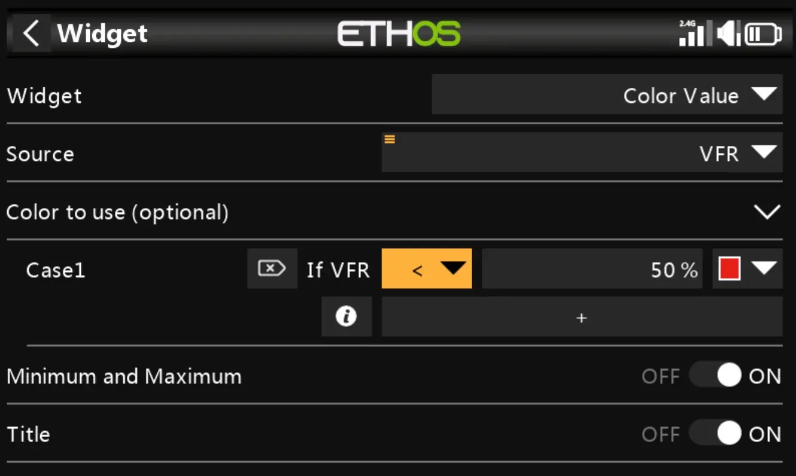
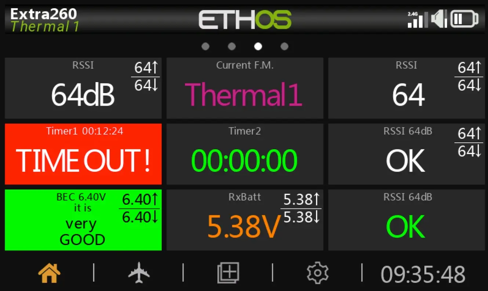

# Color Value : Lua Ethos Widget [[download]](https://github.com/flyingeek/ethos-color-value/releases/latest)

## Features

- Mimics the Ethos's Value widget
- Adapts to many widget sizes
- Dark and Light themes supported
- Up to 5 configurable thresholds, each with his own color
- Telemetry values may display min/max inside the widget or using the contextual menu
- Works fine with timers too
- Background color support
- Custom states (including special tags)
- Beautiful [documentation](https://flyingeek.github.io/astro-color-value/) including a widget simulator
- International language support (cs/de/en/es/fr/it)

Note : Ethos ≥ 1.6.3 required

## ScreenShots

A view of the home page

RxBatt configuration screen (Min/Max OFF)

RxBatt contextual menu

Timer colorization

VFR configuration screen (Min/Max ON)

Demo screen

## Do not miss the documentation

You can really try the widget in your browser with nice guided examples --> [Documentation](https://flyingeek.github.io/astro-color-value/)

## What's in the box ?

After installation, two new widgets become available: **Color Value** and **Color Telemetry**. They use the same underlying code, but **Color Telemetry** filters the source to a telemetry sensor—so if you’re using telemetry, it’s faster to set up with Color Telemetry.

To install or download, go to the [latest release page](https://github.com/flyingeek/ethos-color-value/releases/latest) and follow the instructions.
